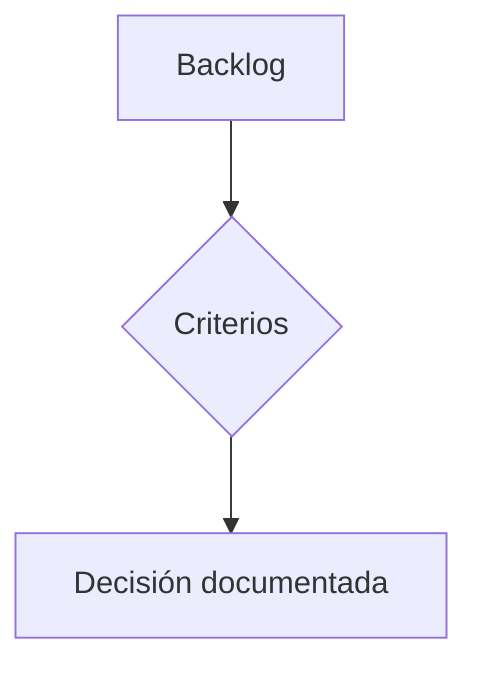

# Taller 1

Contenido pendiente — ver [Contenido de taller 1](../specs/taller-1-contenido.md).

## Sección de ejemplo

Esta sección existe para probar el modo presentación y el render de diagramas.

## Segunda sección

Otra sección de ejemplo, para probar la navegación entre diapositivas.
