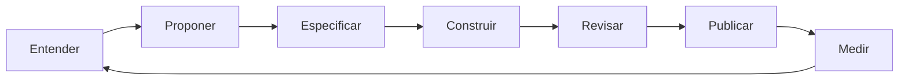
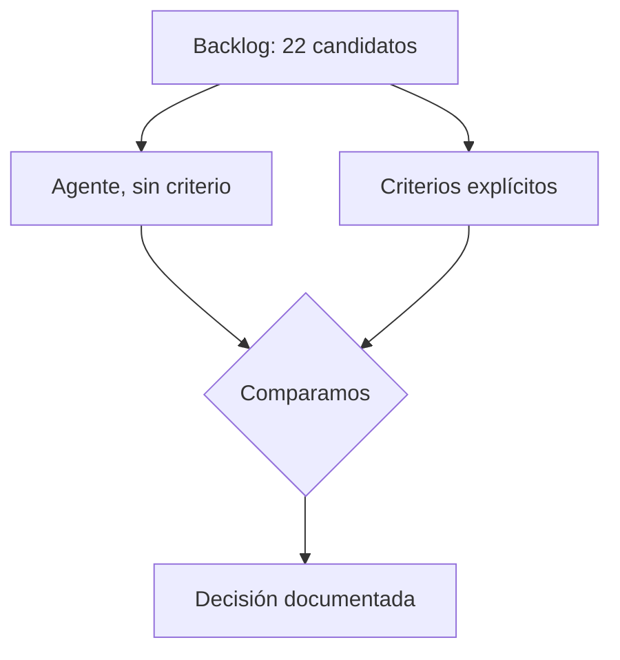

# Taller 1 — Decide qué construir

## Apertura

**Qué construimos:** Buildwise, la app donde vive el método de esta ruta — escrita en público, taller a taller.

**Qué problema resuelve:** ingenieros cuya productividad está limitada porque solo ejecutan especificaciones de otros — sin contexto de producto, sin participación en decisiones, sin responsabilidad de punta a punta. Hacerlos más productivos agregando conocimiento de producto y toma de decisiones como parte de su rol.

**Dónde estamos:** arrancamos desde cero — este es el taller 1, no hay punto de control anterior. Todo lo que ya existe está en `docs/` — incluido el [product brief de Buildwise](/conceptos/product-brief).

**Qué hacemos hoy:** decidimos, con criterios explícitos, qué construye Buildwise primero.

## Pregunta

**¿Alguna vez construiste algo que nadie terminó usando?**

Respóndelo en el chat — o si estás viendo la grabación, pausa un segundo y piénsalo.

## Conocer el producto suma a tu trabajo de ingeniero

- Menos retrabajo tardío
- Soluciones más simples
- Arquitectura que aguanta el rumbo real
- Es la base de por qué existe este taller

Evidencia: [LogRocket — Get engineers involved earlier](https://blog.logrocket.com/product-management/get-engineers-involved-product-development-earlier/)

## El cambio: de implementar a decidir

**La IA baja el costo de producir código. Lo escaso pasa a ser el criterio.**

- Generar ya no es el cuello de botella
- Revisar y decidir, sí
- Se repite en talleres 1 a 9: documentos, interfaces, código
- Hoy es la primera vez que se nombra: **product builder**

Evidencia: [IEEE Spectrum — el rol cambia con la revisión de IA](https://spectrum.ieee.org/ai-code-review-software-engineers)

## Product builder no es lo mismo que product engineer

- **Product engineer** — término ya establecido: ingeniero con criterio de producto
- **Product builder** — dueño de punta a punta: ciclo continuo de entender, proponer, especificar, construir, revisar, publicar y medir
- Esta ruta usa **product builder**

Fuentes: [Atlassian](https://www.atlassian.com/agile/product-management/product-engineering) · [Marian](https://www.marian.coach/blog/product-builder-role/)

## El backlog de hoy

21 candidatos reales, agrupados por a quién sirven.

### Al alumno que se acaba de sumar

| # | Candidato | Qué resuelve |
|---|---|---|
| B1 | Descarga del checkpoint en un clic | Empezar sin pelear con Git |
| B2 | Instrucciones de arranque por taller | Levantarlo en cinco minutos |
| B3 | Vista previa desplegada de cada checkpoint | Ver el estado sin instalar nada |
| B4 | Mapa de la ruta con dependencias | Saber qué necesito antes de este taller |

### Al alumno que sigue la ruta

| # | Candidato | Qué resuelve |
|---|---|---|
| B5 | Conector MCP con plantillas y criterios | Aplicar el método sin salir de donde trabaja |
| B6 | Progreso y checklist por módulo | Trackear avance visible en cada módulo |
| B7 | Bitácora de entregables | Tener mi portafolio al terminar |
| B8 | Diagnóstico de mi repositorio | Saber qué me falta del método |
| B9 | Comparar mi entregable con el de referencia | Saber si lo hice bien |
| B10 | Ejercicios autoevaluables | Practicar sin esperar corrección |
| B11 | Notas personales sobre el material | No perder lo que se me ocurrió leyendo |

### Al que llega por la grabación, meses después

| # | Candidato | Qué resuelve |
|---|---|---|
| B12 | Transcripción buscable | Encontrar el minuto donde se explicó algo |
| B13 | Capítulos enlazados al contenido escrito | Saltar a la parte que importa |
| B14 | Fragmentos compartibles | Mandarle a alguien "mira esto" |
| B15 | Glosario con enlaces cruzados | Entender un término sin ver la clase entera |

### Al docente

| # | Candidato | Qué resuelve |
|---|---|---|
| B16 | Captura de dudas por clase | Material real para el taller 11 |
| B17 | Feedback y comentarios por sección | Saber qué contenido falla y dónde surgen dudas |
| B18 | Analítica de lectura y abandono | Saber dónde se pierde la gente |

### A la comunidad y al negocio

| # | Candidato | Qué resuelve |
|---|---|---|
| B19 | Muro de entregables, con permiso | Ver cómo lo resolvieron otros |
| B20 | Aviso de nueva clase por correo | Mantenerse informado de nuevo contenido |
| B21 | Certificado al completar | Validar y reconocer finalización del curso |

## Los criterios que aplicamos

Ninguno técnico — salen del [product brief de Buildwise](/conceptos/product-brief).

| Criterio | De dónde sale |
|---|---|
| Disponible en el flujo real de trabajo | "no en una página aparte" |
| No requiere memorizar ni copiar a mano | "sin que haga falta memorizarlos ni copiarlos a mano" |
| Origen rastreable a una sesión del curso | "nada inventado para llenar un catálogo" |
| Replicable sin depender de talleres anteriores | "sin depender de haber visto los anteriores" |
| Sin cuentas ni login | "todo el contenido es público" |

## Cómo se decide: tres formas, tu elección

- **Matriz de criterios ponderada** — candidato × criterio, gana quien más cumple
- **MoSCoW** — Must / Should / Could / Won't have, más rápido pero por categorías
- **Esfuerzo / impacto** — útil si el esfuerzo varía mucho entre candidatos

Ninguna es "la correcta" — elige la que te resulte más clara.

## El agente propone, tú decides

Primero el agente prioriza solo, sin criterio. Después aplicamos los 5 criterios.

Un solo criterio — **sin cuentas ni login** — ya descarta media docena de candidatos.

## Cierre

**Entregable de esta semana:**

- `docs/decision-producto.md` — la decisión, publicada
- `criterios/priorizacion.md` — los criterios, documentados

## Extra — para leer después

- [Product Builder — qué es (ES)](https://www.productbuilder.net/es/learn/what-is-a-product-builder)
- [Sprintt.ai — el rol de product builder en 2026](https://sprintt.ai/blog/product-builder-role-2026) (predicción de industria, la fuente más especulativa de esta lista)
