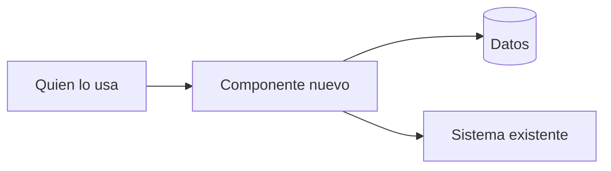

<!--
Antes de escribirlo: si el cambio no crea un componente nuevo, no guarda datos, no expone
nada que otros llamen y es fácil de deshacer, probablemente no necesita diseño. Dilo y no
lo escribas.

Ejemplo de referencia, no un formulario. "Datos" y "Contrato externo" se sacan si no
aplican; las demás secciones van siempre, aunque sea en una línea.

Un diseño técnico (system design) muestra cómo se arma lo que la spec describe. No repite
la spec: la enlaza. Tampoco es la implementación: sin código ni pseudocódigo, sin nombres
de funciones, archivos, variables o tablas, sin versiones ni pasos de trabajo.
Excepciones: los nombres que otros llaman (son contrato) y los que la spec ya usa.

Cada cosa se dice en una sola sección; las demás la nombran por su nombre, no por su
número.

El detalle va según el riesgo: escribe con cuidado lo caro de cambiar (un contrato, un
dato que se guarda, algo difícil de deshacer); deja lo que quien construye decide bien
solo.

Si no sabes algo, no lo inventes: [PENDIENTE: la pregunta], y llévala a "Preguntas
abiertas".

Sugerencia, si tu proyecto no tiene otra convención: guárdalo en docs/system-design/ con
el mismo nombre que su spec (kebab-case-title.md).
-->

# [Nombre de la funcionalidad] — Diseño técnico

| Campo | Valor |
|-------|-------|
| **Estado** | Borrador \| Revisado \| Construido |
| **Spec** | [link a la spec que este diseño implementa] |
| **ADR relacionado** | [link, o "Ninguno"] |

---

## 1. Contexto

[Qué parte de la spec resuelve este diseño y cuál es la idea central, en dos o tres frases.]

**Qué no decide este diseño**
- [Decisión técnica que queda fuera, y por qué. Ej.: "cómo escala a muchos usuarios: el
  volumen esperado no lo exige". El "No incluye" de producto ya está en la spec.]

## 2. Componentes y responsabilidades

<!-- Incluye los que ya existen y los externos. Un componente es un servicio, un proceso,
un almacenamiento o un sistema externo; no un archivo ni una función. Si algo que ya existe
hace algo parecido, di qué pasa con él. El diagrama puede ser ASCII si se va a leer donde
Mermaid no se dibuja. -->

- **[Componente]** (nuevo | existente | modificado) — [de qué se encarga, y de qué no si
  alguien podría suponerlo].

## 3. Flujo

<!-- Lo que pasa por dentro, que la spec no ve: quién recibe el pedido, qué consulta, en qué
orden, dónde queda registrado. Qué recibe quien llama cuando falla va en "Contrato externo";
aquí, solo lo interno. -->

**Camino normal:** [componente] → [componente] → [componente].

**Si [algo falla]:** [qué componente lo detecta, qué hace y qué queda].

**Si [el pedido llega dos veces o se corta a la mitad]:** [qué pasa].

## 4. Reglas que no se rompen

<!-- Lo que tiene que ser cierto siempre y quien construye podría romper sin darse cuenta.
Si ya es un criterio de aceptación de la spec, no la repitas. -->

- **[La regla]** — [por qué importa].

## 5. Datos

<!-- Qué se guarda, de dónde sale y quién lo cambia. En palabras: sin tipos de columna,
índices ni nombres de tabla. Si cambia algo que ya existe, lleva a "Riesgos y operación"
qué pasa con lo ya guardado. -->

**[Entidad]** (nueva | existente | modificada) — [qué es, de dónde sale, quién la cambia].
- [Si es modificada: qué gana, qué pierde o qué cambia de significado. Lo demás sigue igual.]
- [Lo que guarda.]
- [Sus estados, si tiene, y qué la hace pasar de uno a otro.]

## 6. Contrato externo

<!-- Lo que otros sistemas usan: una operación que llaman, un evento o mensaje que
reciben, un archivo que leen. Es lo más caro de cambiar: cambiarlo rompe a quien ya lo usa.
Empieza por cómo se llega (dirección, acceso) si quien lo usa lo configura. -->

**[Operación, evento o archivo, con el nombre que ve quien lo usa]**
- **Recibe:** [qué datos, cuáles son obligatorios].
- **Devuelve:** [qué devuelve o produce, y en qué forma].
- **Si falla:** [qué recibe quien lo usa, y en qué forma, en cada error].

## 7. Decisiones y alternativas

<!-- Las elecciones sobre cómo armar esta funcionalidad, donde había otra opción
razonable. Aquí va solo el porqué: si de la decisión sale una regla, va en "Reglas que no
se rompen". Si la decisión afecta a más que esta funcionalidad (otras partes del proyecto,
cómo se trabaja), va en un ADR y aquí se enlaza. -->

### [Qué se decidió]

- **Alternativa descartada:** [opción] — [por qué no].
- **Por qué esta:** [la razón que pesó].

## 8. Riesgos y operación

<!-- Cada punto con lo que se hace, o "no aplica" y por qué. -->

- **Seguridad:** [quién accede a qué; qué datos se exponen].
- **Migración:** [qué pasa con los datos o usuarios que ya existen].
- **Rollback:** [cómo se deshace si sale mal].
- **Si se cae:** [qué ve quien lo usa y cómo se entera quien lo mantiene].

## 9. Preguntas abiertas

- [PENDIENTE: ...] — [quién y cuándo lo decide]
